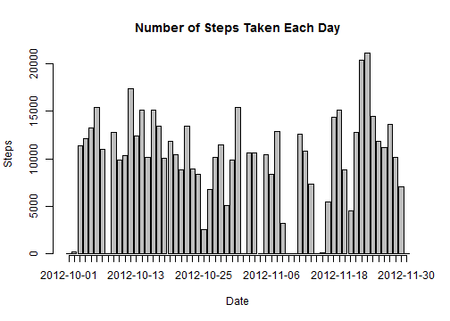
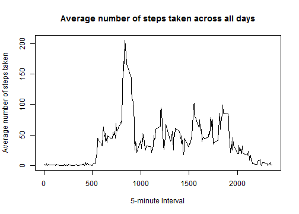
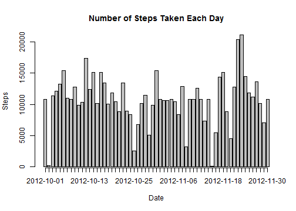
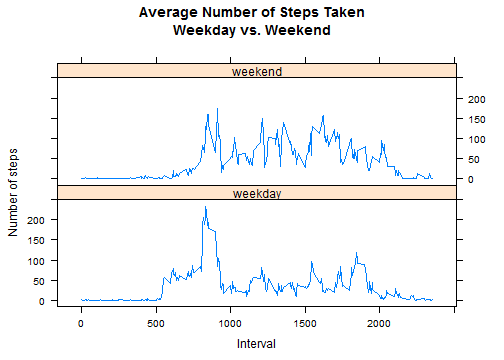

## Load the required libraries 

```r
require(dplyr)
require(lattice)
```


## Loading and preprocessing the data
- Read the raw data from the csv file
- Store the raw data in a Data Frame Table 
- Convert the data column "date" from string type to object of class "Date" 

```r
rawData<-read.csv("activity.csv")
rawTable <- tbl_df(rawData)
rawTable$date<-as.Date(rawTable$date,"%Y-%m-%d")
```


## What is mean total number of steps taken per day?
- Group the data by date
- For each date, calculate the sum of steps taken

```r
totalStep<-rawTable %>%
    group_by(date) %>%
    summarise(sum(steps, na.rm=TRUE))
names(totalStep) <- c("date", "totalstep")
```


Plot histogram of the total number of steps taken each day

```r
barplot(totalStep$totalstep, axis.lty = 1, names.arg = totalStep$date,
        xlab = "Date", ylab = "Steps",
        main = "Number of Steps Taken Each Day")
```

 

Report the mean total number of steps taken per day

```r
mean(totalStep$totalstep)
```

```
## [1] 9354.23
```
Report the median total number of steps taken per day

```r
median(totalStep$totalstep)
```

```
## [1] 10395
```


## What is the average daily activity pattern?
- Group the data by interval
- For each interval, calculate the mean of step taken


```r
intervalStep<-rawTable %>%
    group_by(interval) %>%
    summarise(mean(steps, na.rm=TRUE))
names(intervalStep) <- c("interval","mean")
```


Plot a time series plot of the 5-minute interval and the average number of steps taken, averaged across all days

```r
plot(intervalStep$interval, intervalStep$mean, type="l", 
     xlab="5-minute Interval", ylab="Average number of steps taken", 
     main="Average number of steps taken across all days")
```

 

Report the 5-minute interval, on average across all the days in the dataset, contains the maximum number of steps

```r
intervalStep[which.max(intervalStep$mean),]
```

```
## Source: local data frame [1 x 2]
## 
##     interval     mean
## 104      835 206.1698
```


## Imputing missing values
Report the total number of missing values in the data

```r
sum(!complete.cases(rawTable))
```

```
## [1] 2304
```

Create a new dataset, called newRawTable, that is equal to the original dataset but with the missing data filled in.

Strategy for filling the missing data:

- based on mean for that 5-min interval (left join)
- if "steps" is NA, replace it with the mean value of the corresponding 5-min interval

```r
newRawTable <- rawTable %>%
    left_join(intervalStep, by="interval") %>%
    mutate(steps=ifelse(is.na(steps),mean,steps)) 
```

Plot a histogram of the total number of steps taken each day based on the new dataset

```r
newTotalStep<-newRawTable %>%
    group_by(date) %>%
    summarise(sum(steps, na.rm=TRUE))

names(newTotalStep) <- c("date", "totalsteps")

barplot(newTotalStep$totalstep, axis.lty = 1, names.arg = newTotalStep$date,
        xlab = "Date", ylab = "Steps",
        main = "Number of Steps Taken Each Day")
```

 
Report the mean total number of steps taken per day

```r
mean(newTotalStep$totalstep)
```

```
## [1] 10766.19
```
Report the median total number of steps taken per day

```r
median(newTotalStep$totalstep)
```

```
## [1] 10766.19
```

Describe impact of imputing missing data on the estimates of the total daily number of steps

- The new values, i.e., mean and median, are different from the estimates from the first part of the assignment.
- The new values did not change the shape of the histogram significantly.  It merely added additional bars to some of the "empty" places in the previous histogram.
- The missing data has resulted in lower mean and median of the total daily number of steps.


## Are there differences in activity patterns between weekdays and weekends
Create a new factor variable in the dataset with two levels -- "weekday" and "weekend" indicating whether a given date is a weekday or weekend day.

```r
weekdayRawTable <- rawTable %>%
    mutate(weekday = ifelse(
        weekdays(date) == "Saturday" | weekdays(date)=="Sunday",
        "weekend",
        "weekday")) %>%
    mutate(weekday = factor(weekday))
```

Make a panel plot containing a time series plot of the 5-minute interval and the average number of steps taken, averaged across all weekday days or weekend days.

```r
weekdayIntervalStep<-weekdayRawTable %>%
    group_by(interval, weekday) %>%
    summarise(mean(steps, na.rm=TRUE))

names(weekdayIntervalStep) <- c("interval","weekday", "mean")

p <- xyplot(mean ~ interval | weekday, data=weekdayIntervalStep, 
            type = 'l',
            layout=c(1, 2),
            main="Average Number of Steps Taken\nWeekday vs. Weekend",
            xlab="Interval",
            ylab="Number of steps")
print (p)  
```

 

Based on the plot, it suggests that there is a difference of activity pattern in weekend and weekday:

- During weekend, the level of activity is relatively even througout the day time.
- During weekday, there is much higher level of activity happened in the morning, compared to the rest of the day.
- Generally, people wake up earlier during weekday, compared to weekend.
- On the other hand, the plot also shows that people rest earlier during weekday.
